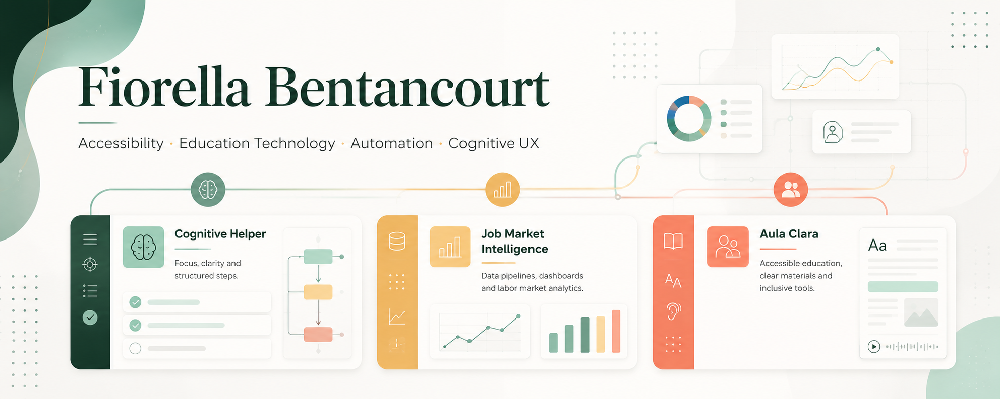

<h1 align="center">Fiorella Bentancourt</h1>

  

  <b>Human-centered Python developer building accessibility and UX-focused tools.</b> 
  Accessibility · Automation · Cognitive UX · Education Technology · Data Systems

  
  
  
  

---

## About Me

I build practical digital tools that make information clearer, tasks easier to follow, and technology more accessible.

My work is especially focused on:

- Accessibility and inclusive design
- Educational tools for teachers and learners
- Cognitive load reduction
- Clear interfaces and structured workflows
- Python, web development, automation, and databases

I care about software that solves real problems, communicates clearly, and shows clean engineering habits.

---

## Sobre mi

Soy desarrolladora Python en formacion full-stack, enfocada en crear herramientas digitales utiles, claras y accesibles.

Me interesa construir tecnologia que ayude a las personas a entender mejor, organizarse mejor y participar con menos barreras.

Trabajo especialmente sobre:

- Accesibilidad digital
- Educacion y tecnologia educativa
- Reduccion de carga cognitiva
- Interfaces claras y usables
- Python, desarrollo web, automatizacion y bases de datos

---

## Current Project

### Aula Clara

Aula Clara is a web platform for teachers that helps detect accessibility barriers in educational materials and transform them into clearer, more structured, and more accessible resources.

The project is based on the social model of disability: it does not try to "fix" students. It focuses on reducing barriers in the educational environment.

Key ideas:

- Clear language versions
- Accessible summaries
- Glossaries for difficult terms
- Activity steps
- Pedagogical accessibility recommendations
- Student mode with large text, focus mode, high contrast, and block-based reading

Status: MVP in private development.

Stack: Next.js, TypeScript, Tailwind CSS, FastAPI, Python, PostgreSQL, SQLModel.

---

## Featured Projects

These are the repositories that best represent my current direction: accessibility-focused development, product thinking, APIs, automation, and structured information systems.

### Cognitive Helper

A cognitive support tool that transforms overwhelming tasks into clear, structured steps.

Repository: https://github.com/bentancourtfiorellanahir-bot/cognitive-helper

Key features:

- Rule-based planning system
- Focus Mode: one step at a time
- Built-in Pomodoro timer
- Accessibility-first design
- Bilingual support: English and Spanish

### Job Market Intelligence

A labor market intelligence platform for ingesting, normalizing, preserving, and serving job-market data from safer public sources.

Repository: https://github.com/bentancourtfiorellanahir-bot/job-market-intelligence

Key features:

- FastAPI backend with PostgreSQL persistence
- Public ATS API ingestion strategy
- Historical snapshots and inactive-job detection
- Normalization and enrichment layer
- Analytics-ready API endpoints
- Dashboard layer served from FastAPI

---

## Tech Stack

  
  
  
  
  
  
  
  

Python · FastAPI · Flask · PostgreSQL · APIs · Automation · Git · HTML · CSS · JavaScript · TypeScript · React · Next.js

---

## Interests

Accessibility · UX · Cognitive UX · Automation · Human-Centered Design · Data Systems · Educational Technology

---

## What I Am Learning

- Full-stack application architecture
- Backend APIs and database design
- Authentication and deploy-ready workflows
- Accessibility from the first design decision
- Clean, maintainable code for real products

---

## What I Am Looking For

I am interested in opportunities where I can:

- Build meaningful products
- Work on accessibility, education, or human-centered technology
- Grow as a developer in a collaborative environment
- Contribute to tools that make complex things easier to use

---

## Contact

- Buenos Aires, Argentina
- Email: bentancourtfiorellanahir@gmail.com
- LinkedIn: https://www.linkedin.com/in/fiorella-nahir-bentancourt-7733a33b6/

---

  <b>Technology should reduce friction, not create it.</b> 
  I build tools that make things clearer, simpler, and more human.

